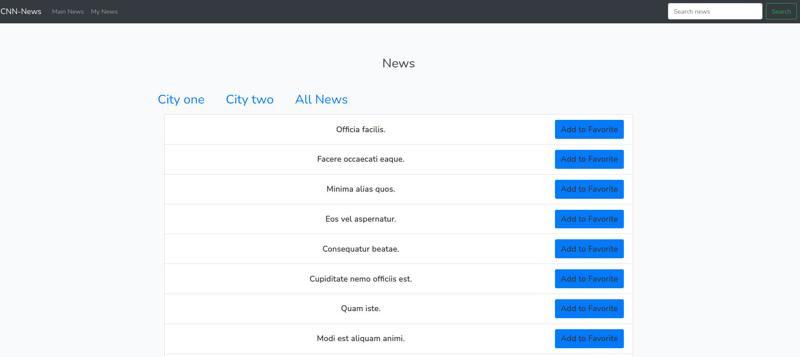
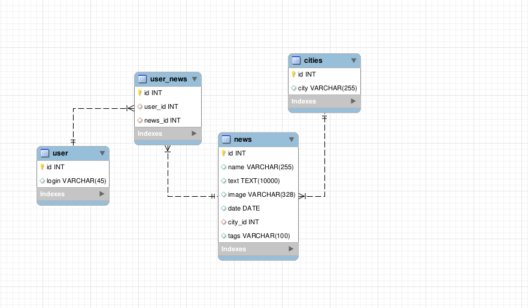

## Проект Новости
Отображение Новостей, Поиск, Похожие новости, Переключение между двумя городами, добавление в избранное.

## Технологии:
PHP 8.0.12
Laravel Framework 8.80.0
Composer version 2.1.5
DB MySql

## Установка

git clone https://github.com/prosto7/news.git
cd news
composer install
npm install

вводим настройки БД в файле .env.example и переименовываем в '.env' 

php artisan key:generate

Далее можем использовать дамп БД файл 'dump.sql', либо сделать миграции
php artisan migrate

Заполняем таблицы фейковыми данными с помощью команды:
php artisan db:seed 

php artisan serve

## Модель БД

